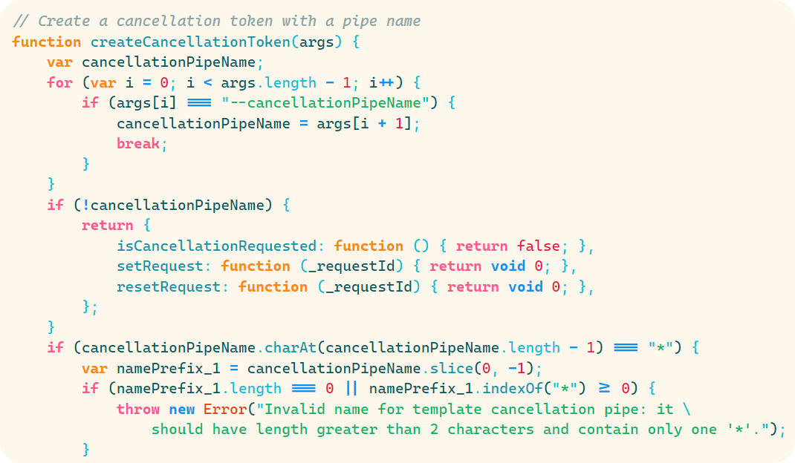
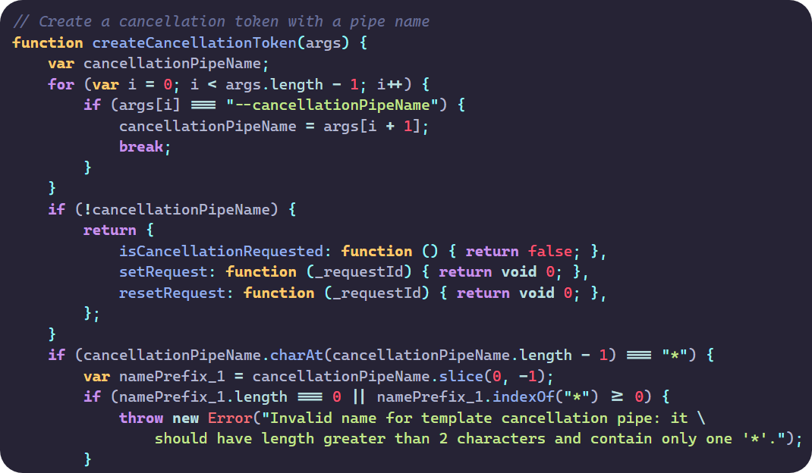

# VSCode Ansi 16 Theme Collection

This is a collection of popular themes adapted to follow the [Ansi 16 syntax highlighting guidelines](https://github.com/chtenb/ansi16).

The font used in the screenshots is cascadia code.

## Noctis Lux Ansi 16

## Synthwave Material Ansi 16

## Material Community Ansi 16

